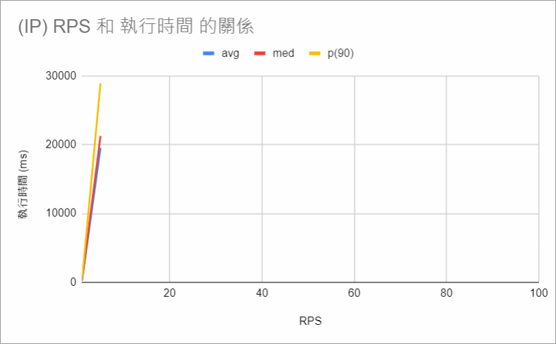
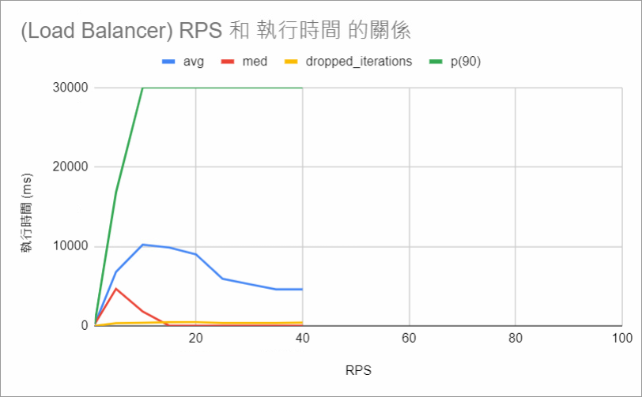

# E-Invoice Performance Testing
以下節錄了兩次壓測的結果，詳細數據請見 `./reports` 資料夾下的 PDF 報告

## Overview
1. [探索系統效能](#探索系統效能)
2. [探索不同雲端架構，對系統效能之影響](#探索不同雲端架構，對系統效能之影響)

## 探索系統效能
- 壓測目的：探索 E-Invoice System 之效能與負載
- 壓測環境：VM n2-standard-2 (vCPUs: 2, RAM: 8GB) on GCP
- 壓測項目：逐步攀升每秒 Request 數，探索巔峰負載
- 壓測情境：
  - 登入功能
  - 直接開立發票 via WEB
  - 訂單開立發票 via API

#### 登入功能
|     | 調整前 | 調整後 |
| --- | --- | --- |
| 推薦負載 | 5 Requests Per Second 95%的使用者等待時間在0.2秒內 | 30 Requests Per Second 95%的使用者等待時間在0.2秒內 |
| 巔峰負載 | 10 Requests Per Second 95%的使用者等待時間在2.1秒內 | 35 Requests Per Second 95%的使用者等待時間在1秒內 |

> 發現有冗餘的程式碼去資料庫撈資料，經確認，該段邏輯是已棄用的功能。\
> 拿掉後，確認可提高系統效能。

#### 直接開立發票
|     | 調整前 | 調整後 |
| --- | --- | --- |
| 推薦負載/巔峰負載 | 35 Requests Per Second | 50 Requests Per Second |

> 發現"剩餘發票號碼數量"會大幅影響 Database 的查詢速度，因此有改寫 SQL。

#### 訂單開立發票
|     | 調整前 | 調整後 |
| --- | --- | --- |
| 推薦負載/巔峰負載 | 105 Requests Per Second | 100 Requests Per Second |

> 發現 Database 的 CPU Usage 在 RPS 超過50後快速攀升。\
> 經確認，是由於 Database Connection Pool 數量設定過少導致的。\
> 該調整，雖然會導致使用者等待時間增加0.1秒，但可大幅減少 Database CPU 用量，因此將該設定值略調高一些。

#### 雲端機器調整
(以其中一位客戶舉例)
客戶資料
- 使用功能：主要使用"訂單開立發票"
- 業務高峰：每天的餐食(11:00-13:00、17:00-19:00)
- 歷史資料：110年，每日最多開立100萬張發票。

> 若100萬張發票，分散於餐食4小時使用，則每秒約開立70張發票\
> 最低規格為1 台2 vCPU 的 VM

目前該客戶的雲端架構：Load Balancer 後有三台 VM，三台 VM 規格皆為4 vCPU 的 VM

> 考量到該客戶資料量，建議規格為最低規格之3倍，以因應瞬間資料湧入的情境。\
> 建議將 Load Balancer 後的三台 VM 的規格都降為2 vCPU。

## 探索不同雲端架構，對系統效能之影響
- 壓測目的：探索使用 Load Balancer 與否，對 E-Invoice System 之效能影響
- 壓測環境：VM e2-medium (vCPUs: 2, RAM: 4GB) on GCP
- 壓測項目：
  - 逐步攀升每秒 Request 數，探索巔峰負載
  - 以每秒10個 request 連續呼叫1小時，測試穩定性
- 壓測情境
  - 透過 IP 呼叫服務
  - 透過 Load balancer 呼叫服務

#### 巔峰負載測試
不使用 Load Balancer
- 系統會回傳 502（服務中斷）

使用 Load Balancer
- 能處理的 request 較多，服務時間會變長但不會中斷

#### 穩定性測試
是否使用 Load Balancer 對執行時間影響不大。
